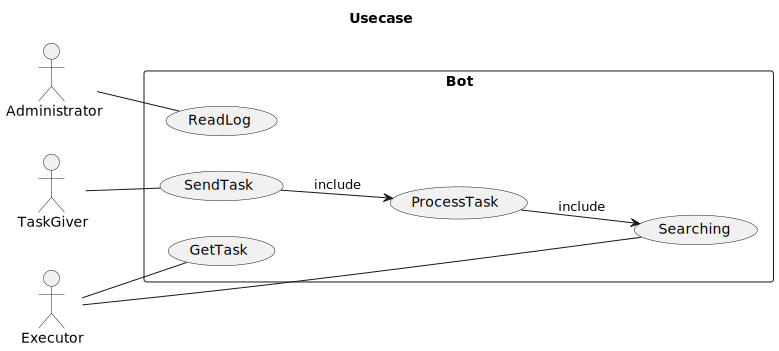
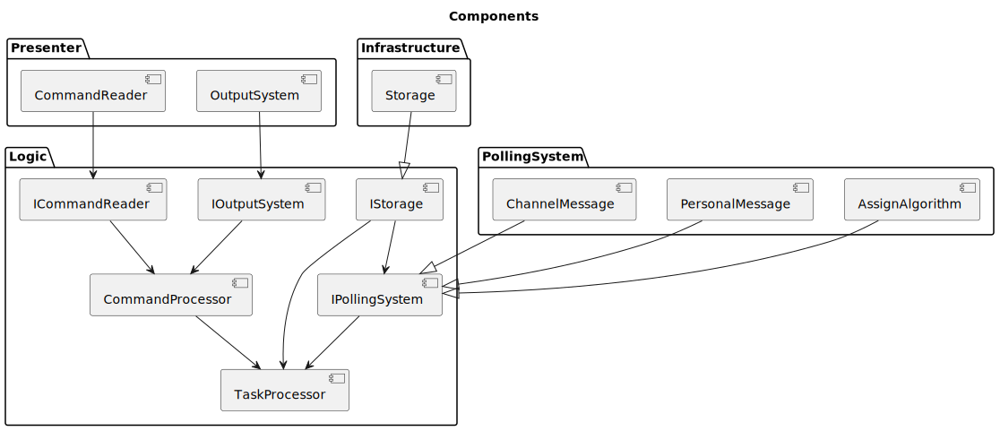
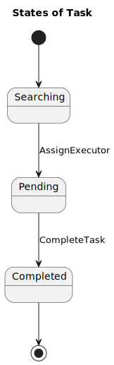
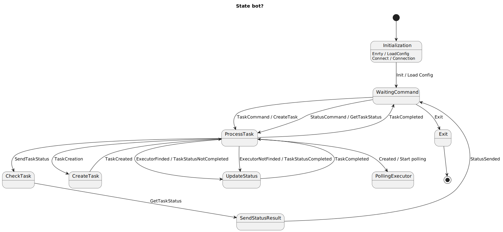

# Записи, Идеи и тд

<!-- TOC -->

- [Записи, Идеи и тд](#%D0%B7%D0%B0%D0%BF%D0%B8%D1%81%D0%B8-%D0%B8%D0%B4%D0%B5%D0%B8-%D0%B8-%D1%82%D0%B4)
    - [Требования](#%D1%82%D1%80%D0%B5%D0%B1%D0%BE%D0%B2%D0%B0%D0%BD%D0%B8%D1%8F)
    - [.](#)
    - [Команда](#%D0%BA%D0%BE%D0%BC%D0%B0%D0%BD%D0%B4%D0%B0)
    - [Сценарий](#%D1%81%D1%86%D0%B5%D0%BD%D0%B0%D1%80%D0%B8%D0%B9)
        - [обозначения](#%D0%BE%D0%B1%D0%BE%D0%B7%D0%BD%D0%B0%D1%87%D0%B5%D0%BD%D0%B8%D1%8F)
        - [возможные проблемы](#%D0%B2%D0%BE%D0%B7%D0%BC%D0%BE%D0%B6%D0%BD%D1%8B%D0%B5-%D0%BF%D1%80%D0%BE%D0%B1%D0%BB%D0%B5%D0%BC%D1%8B)
        - [Компоненты](#%D0%BA%D0%BE%D0%BC%D0%BF%D0%BE%D0%BD%D0%B5%D0%BD%D1%82%D1%8B)
    - [Состояния и события](#%D1%81%D0%BE%D1%81%D1%82%D0%BE%D1%8F%D0%BD%D0%B8%D1%8F-%D0%B8-%D1%81%D0%BE%D0%B1%D1%8B%D1%82%D0%B8%D1%8F)
        - [Бот](#%D0%B1%D0%BE%D1%82)
        - [Задача](#%D0%B7%D0%B0%D0%B4%D0%B0%D1%87%D0%B0)
    - [Диагрмаки](#%D0%B4%D0%B8%D0%B0%D0%B3%D1%80%D0%BC%D0%B0%D0%BA%D0%B8)

<!-- /TOC -->

## Требования

* ...

---

1. [ ] общие требования и ограничения на систему, по типу мне надо так-то, для того, чтобы…
2. [x] роли и прецеденты (+-)
3. [x] сценарии использования (+-)
4. [x] описание основных компонентов системы (+-)
5. [ ] описать состояния компонентов, режимы работы , этапы

## .

* Кто пишет компонент тот пишет и тест для него. Вы знаете как компонент работает вам будет легче написать тест
* Берете за раз один компонент. Сделали, берете следующий который свободен
* Недопускаем работы 2 и более человек над одним файлом 
* Документация не готова, в процессе будет меняться. Над документацией работают все, в качестве финалльного полиша доведем документацию в приемлемый ввид
* Следует Код гайдлайну.
* Создавая модуль, компонент и тд, создавайте новую ветку

## Команда

* Rinat (idrisoff)
* Максим Сырвачев (yksyc147)
* Михаил Мрясов (Plasmat1x)

## Сценарий

1. пользователь с задачей пишет в `дискорд` задачу `командой`
2. `дискорд` отправляет задачу в `бота`
3. `бот` ставит идентификатор задаче
4. `бот` опрашивает исполнителей
   *  A. `бот` отправляет личным сообщением всем исполнителям
   *  B. `бот` отправляет в общий канал задачу
   *  C. `бот` применяет алгоритм и сам назначает исполнителя
5. исполнители принимают `командой`
6. кто первый принял того бот ставит на исполнение и заносит в `хранилище`
7. исполнители выполняют задачу и `командой` `закрывают`
8. бот заносит изменение в `хранилище`

### обозначения

* `бот` - наша служба/приложение
* `дискорд` - система взаимодействия пользователей, исполнителей
* `команда` - способ передаче приложению данных (Guild, Reaction, Message)
* `хранилище` - ФС, БД, ОЗУ (на начальном этапе)
* `закрытие` - установка задаче статус выполнено
* `Objective` - задача

### возможные проблемы

* 4.A 
  * Преймущества: Быстрый поиск исполнителей, приватность
  * Недостатки: Спам, необходимость разрешить конфликты, управление и мониторинг
  * Применение: Мало исполнителий, не частые задачи
* 4.B
  * Преймущества: Прозрачно, легко управлять
  * Недостатки: Приватность
  * Применение: Необходимо что бы были видны задачи, Частота и оперативность
* 4.C
  * Преймущество: Контроль распределения, Без конкуренций, расчет нагрузки исполнителей
  * Недостатки: Справедливый и эффективный алгоритм, исполнитель может быть не готов к моменту назначения, ошибки при назначениях
  * Применение: при возможности и знания занятости исполнителей, важно равномерное распределение задач, когда задачи требуют специфически навыков 

### Компоненты

* Обработчик заданий - (ObjectiveProcessor) - создает, обновляет, назначает исполниетелй для задач, взаимодействует с хранилищем 
* Обработчик комманд - (CommandProcessor) - парсит команду и в зависимости от значения выбирает какой метод запустить
* Ввод данных - (CommandReader) получает Guild клманду (каркаc: Console).
* Вывод данных - (OutputSystem) отправляет сообщения в дискорд (каркас: Console)
* Хранилище - (Storage) хранит логи, задачи, исполнителей (каркас: коллекция)
* Система поиска исполнителей - (PollingSystem) опрос сполнителей на принятие задачи или назначение при помощи алгоритма
* Система логирования (в файл, в косноль, в бд) - формирование логов (каркас: консоль)
* Конфигурация - поддержка конфигурации из файла

## Состояния и события

### Бот
Состояния:

* Инициализация
* Ожидание команды
* Обработка команды
* Создание задачи
* Просмотр статуса задачи
* Обновление задачи
* Поиск исполнителя
* Отправка уведомления

События:

* ... 

### Задача

Состояния:

* Создана
* В поиске исполнителя
* В процессе выполнения
* Завершена / выполнена
* Завершена / невыполнена
  
События:

* Создание
* Назначение
* Поиск
* Выполнена

---

## Диагрмаки

