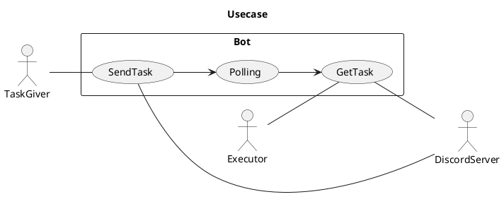
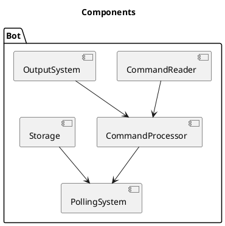
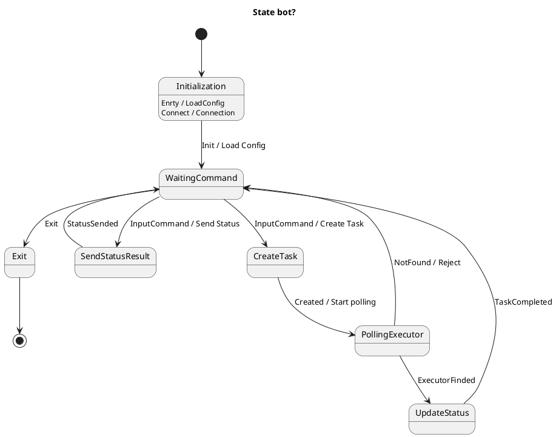
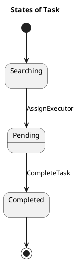

# Записи, Идеи и тд

## Требования

### Сценарий

1. пользователь с задачей пишет в `дискорд` задачу `командой`
2. `дискорд` отправляет задачу в `бота`
3. `бот` ставит идентификатор задаче
4. `бот` опрашивает исполнителей
   *  A. `бот` отправляет личным сообщением всем исполнителям
   *  B. `бот` отправляет в общий канал задачу
   *  C. `бот` применяет алгоритм и сам назначает исполнителя
5. исполнители принимают `командой`
6. кто первый принял того бот ставит на исполнение и заносит в `хранилище`

#### возможные проблемы
* 4.A 
  * Преймущества: Быстрый поиск исполнителей, приватность
  * Недостатки: Спам, необходимость разрешить конфликты, управление и мониторинг
  * Применение: Мало исполнителий, не частые задачи
* 4.B
  * Преймущества: Прозрачно, легко управлять
  * Недостатки: Приватность
  * Применение: Необходимо что бы были видны задачи, Частота и оперативность
* 4.C
  * Преймущество: Контроль распределения, Без конкуренций, расчет нагрузки исполнителей
  * Недостатки: Справедливый и эффективный алгоритм, исполнитель может быть не готов к моменту назначения, ошибки при назначениях
  * Применение: при возможности и знания занятости исполнителей, важно равномерное распределение задач, когда задачи требуют специфически навыков 

---
## Диагрмаки

